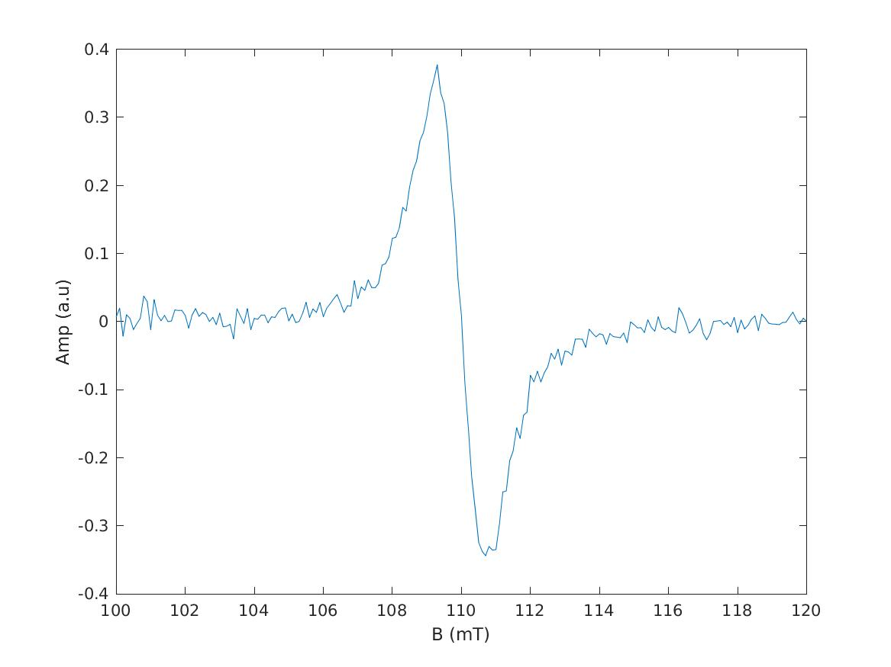
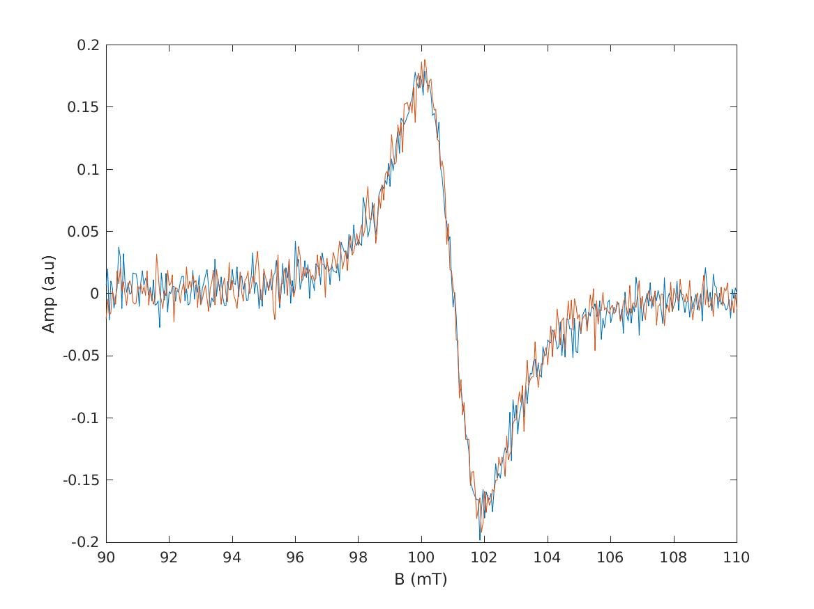

# Lorentz Model with overmodulation for 1D EPR spectra.

This document implements parameter estimation in the general Lorentz model for single-line EPR spectra,
as presented in [Tran-Duc, Frapart, Li-Thiao-Té 2021](https://doi.org/10.1109/TIM.2021.3084289).

Simulation, and MLE parameter estimation (initial values, MLE, precicision).
- `LorentzModel_simulate(B,par)` : simulate EPR spectrum from given parameters, returns an EPR spectrum
- `LorentzModel_initial(B,spec)` : compute initial parameter estimates, returns a `par` struct
- `LorentzModel_ls(B,spec,par_init)` : estimate parameters starting from initial values, returns a `par` struct
- `LorentzModel_mleerror(B,par)` : compute estimates of the parameter precision, returns a `par` struct with precisions
- `LorentzModel(B,spec,par_init)` : convenience function to estimate all parameters, initial parameters are optional, returns a `par` struct with precisions.

where 
- `B` is the magnetic field or x-axis,
- `spec` is the EPR spectrum or y-axis,
- `par` and `par_init` are Matlab structs containing the model parameters:
  - `par.C` is the double integral
  - `par.Br` is the resonant magnetic field
  - `par.FWHM` is Full-Width at Half-Maximum,
  - `par.MA` is the modulation amplitude,
  - `par.v` is the standard deviation of the noise.

# Assets

No assets, EPR spectra are generated in silico in this document.

List of files created:
- `LM_simulate.jpg`: illustrate simulated EPR spectra produced by the Lorentz model.
- `LM_simulate2.jpg`

# Method 1 : Simulate Lorentz model

We first define the Lorentz lineshape.

```matlab
function [spec] = LorentzShape(B)
  % Normalized Lorentz shape, area=1, width=1
  spec = (B.^2+1).^(-1) ./ pi;
end
```

The general Lorentz model for single-line EPR spectra is obtained by translating, rescaling and applying modulation amplitude
to the Lorentz lineshape. We define it with the following code.


```matlab
function [spec] = LorentzModel_simulate(B,par)
  % LorentzModel with area C, location Br, full width half max FWHM
  % Finite difference / modulation amplitude MA
  % Additive white Gaussian noise of standard deviation v
  % FWHM, Br and MA are in the same units as B
  FWHM_2 = par.FWHM / 2;
  spec = par.C / FWHM_2 * (LorentzShape((B-par.Br+par.MA/2) ./ FWHM_2) - LorentzShape((B-par.Br-par.MA/2)./FWHM_2))+randn(size(B))*par.v;
end
```

Simulated EPR spectra can be generated according to the following example.


```matlab
addpath(genpath('Code'))
Xmt = 100:0.1:120;
par.C = 2; par.FWHM = 2; par.Br = 110; par.v = 0.01; par.MA = 1;
spec = LorentzModel_simulate(Xmt,par);

fig=figure();
plot(Xmt,spec)
xlabel ('B (mT)');
ylabel ('Amp (a.u)');
saveas(fig,'LM_simulate.jpg')

exit
```


```text
matlab -nodisplay -nodesktop  -r test_simu
```

```text

                                                                              < M A T L A B (R) >
                                                                    Copyright 1984-2020 The MathWorks, Inc.
                                                                R2020b Update 8 (9.9.0.2037887) 64-bit (glnxa64)
                                                                                August 10, 2022

 
To get started, type doc.
For product information, visit www.mathworks.com.
 
```




# Method 2 : Initial parameter estimates


```matlab
function [parLM] = LorentzModel_initial(B,spec)
    [y_max, index_max]=max(spec);[y_min, index_min]=min(spec);
    parLM.Br = (B(index_max)+B(index_min))/2;
    parLM.FWHM = (B(index_min)-B(index_max))*sqrt(3);
    parLM.C = 1; parLM.v = 0;
    parLM.MA = 0.5; % arbitrary initial guess
    spec_temp = LorentzModel_simulate(B, parLM);
    parLM.C = spec_temp(:) \ spec(:); % Linear regression
    parLM.v = std(spec - spec_temp * parLM.C);
end
```


# Method 3 : MLE parameter estimates

In this section we implement Maximum-Likelihood estimates. We define the likelihood function, but it is never used, as we 
prefer the least-squares (equivalent) estimate.


```matlab
function l = lnl(XmT,spec,par)
    % Likelihood function
    lnL=@(t)(length(spec)/2)*log(2*pi*t(1)^2)+norm(spec-(t(2)*(2/t(5)^2)*sqrt(2*(1+((t(4)/2)/t(5))^2+((XmT-t(3))./t(5)).^2)-(1+((t(4)/2)/t(5))^2+((XmT-t(3))./t(5)).^2+((1+((t(4)/2)/t(5))^2+((XmT-t(3))./t(5)).^2).^2-4*((XmT-t(3))./t(5)).^2).^(1/2)))./(2*sqrt((1+((t(4)/2)/t(5))^2+((XmT-t(3))./t(5)).^2+((1+((t(4)/2)/t(5))^2+((XmT-t(3))./t(5)).^2).^2 - 4*((XmT-t(3))./t(5)).^2).^(1/2))-2).*((1+((t(4)/2)/t(5))^2+((XmT-t(3))./t(5)).^2+((1+((t(4)/2)/t(5))^2+((XmT-t(3))./t(5)).^2).^2 -4*((XmT-t(3))./t(5)).^2).^(1/2))-(1+((t(4)/2)/t(5))^2+((XmT-t(3))./t(5)).^2)))) ).^2./(2*t(1)^2);
    l = lnL([par.v,par.C,par.Br,par.FWHM,par.MA]);
```


```matlab
function [parLS] = LorentzModel_ls(XmT,spec,init)
    % Least-squares estimate
    f = @(t)(norm(spec - LorentzModel_simulate(XmT,vect_to_par(t))));
    parLS = vect_to_par(fminsearch(f,par_to_vect(init)));
    parLS.v = std(spec - LorentzModel_simulate(XmT,parLS));
end

% Local functions

function [par] = vect_to_par(t)
% Convert from vector to parameter struct
par.v = 0; par.C = t(2); par.Br = t(3); par.FWHM = t(4); par.MA = t(5);
end

function [t] = par_to_vect(par)
% Convert from parameter struct to vector
t = [par.v; par.C; par.Br; par.FWHM; par.MA];
end
```

We check the estimation code by comparing the resulting estimates with the correct values on a simulated spectrum.


```matlab
addpath(genpath('Code'))
Xmt = 90:0.05:110;
par.C = 2; par.FWHM=3; par.Br = 101; par.v = 0.01; par.MA = 1;
par % parameters used in the simulation

spec = LorentzModel_simulate(Xmt,par);
parInit = LorentzModel_initial(Xmt,spec)
parMLE = LorentzModel_ls(Xmt,spec,parInit) 

fig=figure();
spec_mle = LorentzModel_simulate(Xmt,parMLE);
plot(Xmt,spec, Xmt,spec_mle)
xlabel ('B (mT)'); ylabel ('Amp (a.u)');
saveas(fig,'LM_simulate2.jpg')
exit
```


```text
date
matlab -nodisplay -nodesktop  -r test_esti

```

```text
Tue 20 Jun 12:25:27 UTC 2023

                                                                              < M A T L A B (R) >
                                                                    Copyright 1984-2020 The MathWorks, Inc.
                                                                R2020b Update 8 (9.9.0.2037887) 64-bit (glnxa64)
                                                                                August 10, 2022

 
To get started, type doc.
For product information, visit www.mathworks.com.
 

par = 

  struct with fields:

       C: 2
    FWHM: 3
      Br: 101
       v: 0.0100
      MA: 1


parInit = 

  struct with fields:

      Br: 100.9750
    FWHM: 3.0311
       C: 3.9255
       v: 0.0107
      MA: 0.5000


parMLE = 

  struct with fields:

       v: 0.0103
       C: 1.8566
      Br: 100.9958
    FWHM: 2.9413
      MA: 1.0609

```

The following figure shows the simulated spectrum and a reconstruction from the estimated parameters.




# Method 4 : precision of the parameter estimates

To compute the precision of the parameter estimates, we compute the Cramer-Rao Lower Bound, and use it as an estimate
of the covariance matrix of the maximum-likelihood estimates. This involves computing the Fisher information matrix,
and in particular, involves computing the derivatives of the log-likelihood function. 

The computations are performed
and validated using the `sympy` library for formal calculus in Python in the file `LorentzModel_hessian.nw`. We import
the resulting formulae and translate them into matlab. Consequently, we will show the python code above the corresponding
matlab code in this section.


## Lorentz mother shape and derived Matlab functions

We first recall the expression of the Lorentz lineshape model.


```shell
sed -n '464,+3p' Code/LorentzModel_hessian.md
```

```text
    1     
──────────
  ⎛ 2    ⎞
π⋅⎝B  + 1⎠
```

According to `LorentzModel_hessian.nw`, we need to define the following functions in addition to the mother shape:

```shell
sed -n '272,+4p' Code/LorentzModel_hessian.md
```

```python
AbsB = Abs.diff(B)
AbsBB = Abs.diff(B).diff(B)
BAbsB = B*AbsB
BAbsBB = B*AbsBB
BBAbsBB = B*B*AbsBB
```

We use `sympy` to compute the derivatives of the Lorentz mother shape:

```shell
sed -n '473,+16p' Code/LorentzModel_hessian.md
```

```python
Lorentz.diff(B)
Lorentz.diff(B).diff(B)

```

```text
   -2⋅B    
───────────
          2
  ⎛ 2    ⎞ 
π⋅⎝B  + 1⎠ 
       2                 
    8⋅B            2     
─────────── - ───────────
          3             2
  ⎛ 2    ⎞      ⎛ 2    ⎞ 
π⋅⎝B  + 1⎠    π⋅⎝B  + 1⎠ 
```

We define these in Matlab as functions that operate on the vector `B` that contains the magnetic field values. 
In the next section, we define the `ds` and `dms` operators that operate on these functions.

```text
Abs   = @(B) LorentzShape(B);
AbsB  = @(B) -2/pi * B ./ (B.^2 + 1).^2;
AbsBB = @(B) ( 8/pi * B.^2 - 2/pi * (B.^2 + 1) ) ./ (B.^2 + 1).^3;
BAbsB = @(B) B .* AbsB(B);
BAbsBB = @(B) B .* AbsBB(B);
BBAbsBB = @(B) B.^2 .* AbsB(B);
```


## Translation, scale and finite difference operators

In the Fisher information matrix, we remark that the resulting expressions only involve the following two operators.
We apply them to the function aliases defined in the previous sections to obtain real-valued vectors.


```shell
sed -n '300,+7p' Code/LorentzModel_hessian.md
```

```text
def ds(e):
    # dma(scale(e))
    return e.subs(B,(B-Br+MA/2)/gamma)/gamma - e.subs(B,(B-Br-MA/2)/gamma)/gamma

def dms(e):
    # dmam(scale(e))
    return e.subs(B,(B-Br+MA/2)/gamma)/gamma/2 + e.subs(B,(B-Br-MA/2)/gamma)/gamma/2

```


```text
ds = @(f) f( (B-par.Br+par.MA/2)/gamma)/gamma - f( (B-par.Br-par.MA/2)/gamma)/gamma;
dms = @(f) f( (B-par.Br+par.MA/2)/gamma)/gamma/2 + f( (B-par.Br-par.MA/2)/gamma)/gamma/2;
```


## Check

To check that the formulae and operators are correctly implemented, we set some parameters and compute AbsB and AbsBB 
both in python and matlab, as well as ds(AbsB) and dms(AbsB).


```shell
sed -n '496,+19p' Code/LorentzModel_hessian.md
```

```python
AbsB = Lorentz.diff(B); AbsB.subs(B,3)
AbsBB = Lorentz.diff(B).diff(B); AbsBB.subs(B,3)
ds(AbsB).subs([(B,3),(Br,10),(MA,2),(gamma,6)])
dms(AbsB).subs([(B,3),(Br,10),(MA,2),(gamma,6)])

```

```text
-3  
────
50⋅π
  13 
─────
250⋅π
 193  
──────
7500⋅π
  1057 
───────
15000⋅π
```


```text
addpath(genpath('Code'))
B = 3; par.Br = 10; par.MA = 2; gamma = 6;
<<hessian_function_aliases>>
<<hessian_ds_operators>>
AbsB(3) - (-3)/(50*pi)
AbsBB(3) - 13/(250*pi)
ds(AbsB) - 193 / (7500*pi)
dms(AbsB) - 1057 / (15000*pi)
exit
```


```text
matlab -nodisplay -nodesktop -r check1
```

```text

                                                                              < M A T L A B (R) >
                                                                    Copyright 1984-2020 The MathWorks, Inc.
                                                                R2020b Update 8 (9.9.0.2037887) 64-bit (glnxa64)
                                                                                August 10, 2022

 
To get started, type doc.
For product information, visit www.mathworks.com.
 

ans =

     0


ans =

     0


ans =

  -1.7347e-18


ans =

   3.4694e-18

```

We also check that vectorization works by computing the same quantities when B is a vector. Every result should be equal to 0 up to machine precision.


```shell
sed -n '520,+19p' Code/LorentzModel_hessian.md
```

```python
AbsB = Lorentz.diff(B); AbsB.subs(B,5)
AbsBB = Lorentz.diff(B).diff(B); AbsBB.subs(B,5)
ds(AbsB).subs([(B,5),(Br,10),(MA,2),(gamma,6)])
dms(AbsB).subs([(B,5),(Br,10),(MA,2),(gamma,6)])

```

```text
 -5  
─────
338⋅π
  37  
──────
4394⋅π
  47  
──────
2028⋅π
 385  
──────
4056⋅π
```


```text
addpath(genpath('Code'))
B = [3,5]; par.Br = 10; par.MA = 2; gamma = 6;
<<hessian_function_aliases>>
<<hessian_ds_operators>>
AbsB(B) - [-3/(50*pi), -5/(338*pi)]
AbsBB(B) - [13/(250*pi), 37/(4394*pi)]
ds(AbsB) - [193 / (7500*pi), 47/(2028*pi)]
dms(AbsB) - [1057 / (15000*pi), 385/(4056*pi)]
exit
```


```text
matlab -nodisplay -nodesktop -r check2
```

```text

                                                                              < M A T L A B (R) >
                                                                    Copyright 1984-2020 The MathWorks, Inc.
                                                                R2020b Update 8 (9.9.0.2037887) 64-bit (glnxa64)
                                                                                August 10, 2022

 
To get started, type doc.
For product information, visit www.mathworks.com.
 

ans =

   1.0e-18 *

         0   -0.8674


ans =

   1.0e-18 *

         0    0.4337


ans =

   1.0e-17 *

   -0.1735    0.0867


ans =

   1.0e-17 *

    0.3469         0

```


## Implement the Hessian formulae

The implementation is contained in the `LorentzModelM_mleerror.m` file. Using Lepton, we write this file in several parts,
starting with the definition of the main function and the parameters, function aliases, and operators.

```matlab
function prec = LorentzModel_mleerror(B,par)
  % return the precision estimates as a struct
  n=length(B); gamma = par.FWHM/2;
  <<hessian_function_aliases>>
  <<hessian_ds_operators>>
  par0 = par; par0.v = 0;
  EPR=LorentzModel_simulate(B,par0);
```

We now compute each element of the Hessian matrix. We first import the formula from the python script, then translate them 
into matlab code and compute the expectation. Let's start with `dv*`. Note that the only random variable here is Y,
and its expectation is EPR.

```shell
sed -n '320,+4p' Code/LorentzModel_hessian.md
```

```python
dvv =  n / v**2 - 3 / v**4 * (Y - EPR)**2;
dvC = -2 / v**3 / C * (Y - EPR) * EPR
dvB =  2 / gamma * C / v**3 * (Y - EPR) * ds(AbsB)
dvM = -2 / gamma * C / v**3 * (Y - EPR) * dms(AbsB)
dvg =  2 / gamma * C / v**3 * (Y - EPR) * (ds(Abs)+ds(BAbsB))
```


```matlab
dvv = -2*n/par.v^2;
dvC = 0; dvB = 0; dvM = 0; dvg = 0; 
```

Next we implement `dC`.


```shell
sed -n '350,+3p' Code/LorentzModel_hessian.md
```

```python
dCC = -1 / v ** 2 * ds(Abs) ** 2
dCB = -1 / v ** 2 / gamma * (Y - 2*EPR) * ds(AbsB)
dCM =  1 / v ** 2 / gamma * (Y - 2*EPR) * dms(AbsB)
dCg = -1 / v ** 2 / gamma * (Y - 2*EPR) * (ds(Abs)+ds(BAbsB))
```


```matlab
dCv = dvC;
dCC = -1 / par.v^2 * sum(ds(Abs).^2);
dCB = -1 / par.v^2 / gamma * sum( -EPR .* ds(AbsB));
dCM =  1 / par.v^2 / gamma * sum( -EPR .* dms(AbsB));
dCg = -1 / par.v^2 / gamma * sum( -EPR .* (ds(Abs)+ds(BAbsB)));
```

Next we implement `dB`.


```shell
sed -n '378,+2p' Code/LorentzModel_hessian.md
```

```python
dBB = -C / v**2 / gamma**2 * ( C * ds(AbsB)**2 - (Y-EPR) * ds(AbsBB) )
dBM = -C / v**2 / gamma**2 * ( -C * dms(AbsB) * ds(AbsB) + (Y-EPR) * dms(AbsBB) )
dBg = -C / v**2 / gamma**2 * ( (3*EPR-2*Y + C*ds(BAbsB)) * ds(AbsB) - (Y-EPR) * ds(BAbsBB)  )
```


```matlab
dBv = dvB;
dBC = dCB;
dBB = -par.C / par.v^2 / gamma^2 * sum( par.C * ds(AbsB).^2 );
dBM = -par.C / par.v^2 / gamma^2 * sum( -par.C * dms(AbsB) .* ds(AbsB) );
dBg = -par.C / par.v^2 / gamma^2 * sum( (EPR + par.C*ds(BAbsB)) .* ds(AbsB)  );
```

Next we implement `dM`.

```shell
sed -n '405,+1p' Code/LorentzModel_hessian.md
```

```python
dMM = C / v**2 / gamma**2 * (-C * dms(AbsB)**2 + (Y-EPR) * ds(AbsBB)/4 )
dMg = C / v**2 / gamma**2 * ( C * (ds(Abs)+ds(BAbsB)) * dms(AbsB) - (Y-EPR) * (2*dms(AbsB) + dms(BAbsBB)) )
```


```matlab
dMv = dvM;
dMC = dCM;
dMB = dBM;
dMM = par.C / par.v^2 / gamma^2 * sum(-par.C * dms(AbsB).^2 );
dMg = par.C / par.v^2 / gamma^2 * sum( par.C * (ds(Abs)+ds(BAbsB)) .* dms(AbsB) );
```

And finally we implement `dg`.


```shell
sed -n '431p' Code/LorentzModel_hessian.md
```

```python
dgg = C / v**2 / gamma**2 * ( -C*(ds(Abs)+ds(BAbsB))**2 + (Y-EPR)*(2*ds(Abs) + 4*ds(BAbsB) + ds(BBAbsBB)))
```


```matlab
dgv = dvg;
dgC = dCg;
dgB = dBg;
dgM = dMg;
dgg = par.C / par.v^2 / gamma^2 * sum( -par.C*(ds(Abs)+ds(BAbsB)).^2 );
```

We now assemble the elements of the Hessian matrix and compute the Fisher Information Matrix.
Note that when condition number is bad, estimates may be very poor due to numerical errors. Set the estimates to -1 in that case.

```matlab
hessian = [dvv, dvC, dvB, dvM, dvg; dCv, dCC, dCB, dCM, dCg; dBv, dBC, dBB, dBM, dBg; dMv, dMC, dMB, dMM, dMg; dgv, dgC, dgB, dgM, dgg];
prec = par;
if rcond(hessian) > 1e-20
    cov = inv(-hessian);
    prec.ev = sqrt(cov(1,1)); prec.eC = sqrt(cov(2,2)); prec.eBr = sqrt(cov(3,3)); prec.eMA = sqrt(cov(4,4)); prec.eFWHM = 2*sqrt(cov(5,5)); 
else
    prec.ev = -1; prec.eC = -1; prec.eBr = -1; prec.eMA = -1; prec.eFWHM = -1;
end
```

We test this code on a single simulated spectrum. `par_mle` should be close to the correct parameters `par`. 
In addition, the difference `par-par_mle` should be on the order of `prec_mle`, and `prec_mle` should be close to `prec_mle0` 
(precision computed from the true parameter values). The same parameters were used as in the previous figures.


```text
addpath(genpath('Code'))
Xmt = 90:0.05:110;
par.C = 2; par.FWHM=3; par.Br = 101; par.v = 0.01; par.MA = 1;
par
spec = LorentzModel_simulate(Xmt,par);
parInit = LorentzModel_initial(Xmt,spec);
par_mle = LorentzModel_ls(Xmt,spec,parInit)
spec_mle = LorentzModel_simulate(Xmt,par_mle);
prec_mle = LorentzModel_mleerror(Xmt,par_mle)
prec_mle0 = LorentzModel_mleerror(Xmt,par)
exit
```


```text
date
matlab -nodisplay -nodesktop  -r test_error

```

```text
Tue 20 Jun 12:25:50 UTC 2023

                                                                              < M A T L A B (R) >
                                                                    Copyright 1984-2020 The MathWorks, Inc.
                                                                R2020b Update 8 (9.9.0.2037887) 64-bit (glnxa64)
                                                                                August 10, 2022

 
To get started, type doc.
For product information, visit www.mathworks.com.
 

par = 

  struct with fields:

       C: 2
    FWHM: 3
      Br: 101
       v: 0.0100
      MA: 1


par_mle = 

  struct with fields:

       v: 0.0103
       C: 1.8566
      Br: 100.9958
    FWHM: 2.9413
      MA: 1.0609


prec_mle = 

  struct with fields:

        v: 0.0103
        C: 1.8566
       Br: 100.9958
     FWHM: 2.9413
       MA: 1.0609
       ev: 3.6403e-04
       eC: 0.2937
      eBr: 0.0073
      eMA: 0.1485
    eFWHM: 0.0772


prec_mle0 = 

  struct with fields:

        C: 2
     FWHM: 3
       Br: 101
        v: 0.0100
       MA: 1
       ev: 3.5311e-04
       eC: 0.3583
      eBr: 0.0072
      eMA: 0.1612
    eFWHM: 0.0773

```


## Simulation test

We check that the precision formulae are correct by computing the observed covariance through simulations. 


```text
addpath(genpath('Code'))
Xmt = 90:0.05:110;
par.C = 2; par.FWHM=3; par.Br = 101; par.v = 0.01; par.MA = 1;
prec = LorentzModel_mleerror(Xmt,par);

nb_iter = 200;
bench = zeros(nb_iter,5);
for i = 1:nb_iter
    spec = LorentzModel_simulate(Xmt,par);
    parInit = LorentzModel_initial(Xmt,spec);
    par_mle = LorentzModel_ls(Xmt,spec,parInit);
    bench(i,1:5) = [par_mle.v par_mle.C par_mle.Br par_mle.MA par_mle.FWHM];
end

disp(sprintf('Observed means %s, \nExpected means %f %f %f %f %f', sprintf('%f ',mean(bench,1)), par.v, par.C, par.Br, par.MA, par.FWHM))

disp(sprintf('Observed stds %s, \nExpected stds %f %f %f %f %f', sprintf('%f ',std(bench)), prec.ev, prec.eC, prec.eBr, prec.eMA, prec.eFWHM))


exit
```


```text
date
matlab -nodisplay -nodesktop  -r test_cov

```

```text
Tue 20 Jun 12:25:57 UTC 2023

                                                                              < M A T L A B (R) >
                                                                    Copyright 1984-2020 The MathWorks, Inc.
                                                                R2020b Update 8 (9.9.0.2037887) 64-bit (glnxa64)
                                                                                August 10, 2022

 
To get started, type doc.
For product information, visit www.mathworks.com.
 
 
Exiting: Maximum number of function evaluations has been exceeded
         - increase MaxFunEvals option.
         Current function value: 0.202797 

 
Exiting: Maximum number of function evaluations has been exceeded
         - increase MaxFunEvals option.
         Current function value: 0.205612 

 
Exiting: Maximum number of function evaluations has been exceeded
         - increase MaxFunEvals option.
         Current function value: 0.195638 

Observed means 0.009905 2.182319 100.999739 0.980518 2.998832 , 
Expected means 0.010000 2.000000 101.000000 1.000000 3.000000
Observed stds 0.000361 0.939462 0.007503 0.185329 0.077804 , 
Expected stds 0.000353 0.358256 0.007181 0.161210 0.077289
```


# Method 5 : convenience function

We provide the following convenience function that performs estimation with default parameters in a single call.

```text
function [parLM] = LorentzModel(XmT, spec, parLM_initial)
    if ~exist('parLM_initial','var')
        parLM_initial = LorentzModel_initial  (XmT,spec);
    end
    parLM_mle = LorentzModel_ls      (XmT,spec,parLM_initial);
    parLM = LorentzModel_mleerror (XmT,parLM_mle);
```
