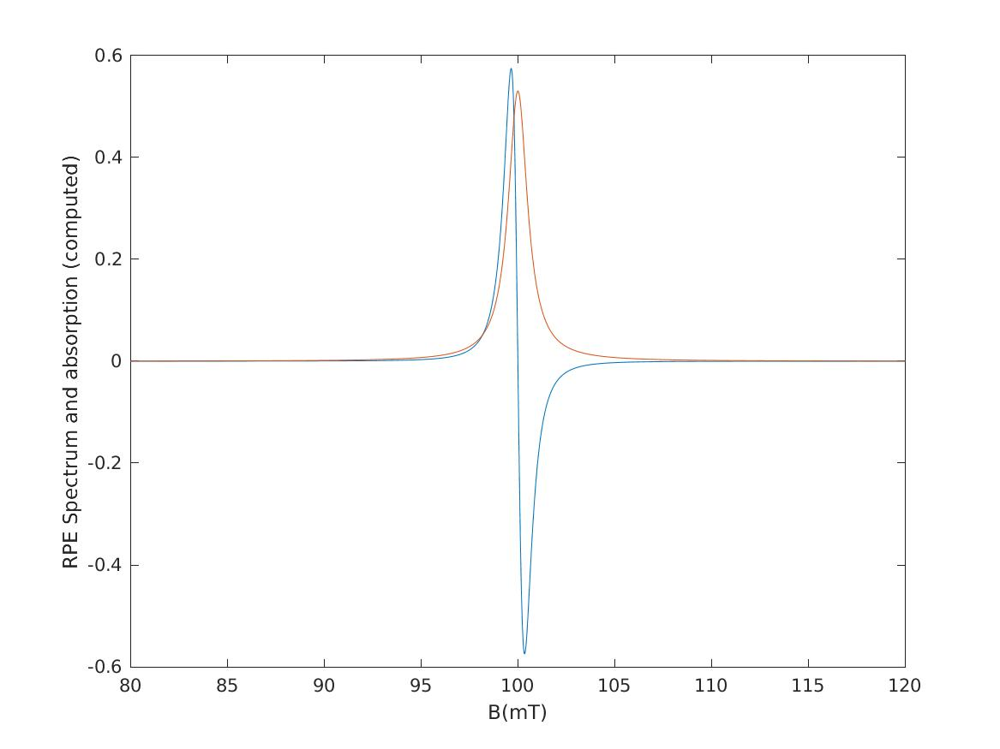

# Lorentz Model in the derivative-limit

This document implements parameter estimation as presented in [Duc-Tran, Frapart, Li-Thiaote, 2017](https://doi.org/10.1109/ATC.2017.8167620), 
including estimates of the precision.

Functions provided in this file:
- `LorentzModelDeri_simulate(B,par)` : simulate EPR spectrum from given parameters, returns an EPR spectrum
- `LorentzModelDeri_initial(B,spec)` : compute initial parameter estimates, returns a `par` struct
- `LorentzModelDeri_mle(B,spec,par_init)` : estimate parameters starting from initial values, returns a `par` struct
- `LorentzModelDeri_mleerror(B,par)` : compute estimates of the parameter precision, returns a `par` struct with precisions,
- `LorentzModelDeri(B,spec,par_init)` : convenience function to estimate all parameters, initial parameters are optional, returns a `par` struct with precisions.

where 
- `B` is the magnetic field or x-axis,
- `spec` is the EPR spectrum or y-axis,
- `par` and `par_init` are Matlab structs containing the model parameters:
  - `par.C` is the double integral
  - `par.Br` is the resonant magnetic field
  - `par.FWHM` is Full-Width at Half-Maximum,
  - `par.v` is the standard deviation of the noise.

# Assets and Artefacts

This document uses `Assets/Test-data` for testing the code on the `TAM21` file. 
It produces 
- `LMD_simulate.jpg` : illustrate the `LorentzModelDeri_simulate` function
- `LMD_TAM21.jpg` : illustrate how this model fits to a real TAM EPR spectrum.


# Method 1 : simulate spectrum according to Lorentz derivative-limit model

The simulation function is defined according to the ATC17 paper :

```text
function [spec] = LorentzModelDeri_simulate(B,parLMD)
BmBr = B - parLMD.Br; % used only to simplify expression
spec = - parLMD.C * parLMD.FWHM / pi * BmBr ./ (1/4*parLMD.FWHM^2 + BmBr .^2 ).^2 + randn(size(B))*parLMD.v;
end
```

The following matlab script is used for testing the correctness of the simulation function.

```text
addpath(genpath('Code'))
dB=0.02;
B = 80:dB:120;
parLMD.C = 1; parLMD.FWHM=1.2; parLMD.Br = 100; parLMD.v = 0;
spec = LorentzModelDeri_simulate(B,parLMD);

% Check parameter values
disp(sprintf('Observed C = %f, expected = %f',trapz(cumtrapz(spec))*dB*dB,parLMD.C))
[y_max, index_max]=max(spec);[y_min, index_min]=min(spec);
disp(sprintf('Observed Br = %f, expected = %f',(B(index_max)+B(index_min))/2,parLMD.Br))
disp(sprintf('Observed p2p = %f, expected = %f',B(index_min)-B(index_max),parLMD.FWHM/sqrt(3)))
spec_abs = cumtrapz(spec)*dB; % absorption
[y_max, index_max]=max(spec_abs);
spec_abs_aux = abs(spec_abs - y_max/2);
[y1, i1]=min(spec_abs_aux + (B>parLMD.Br));
[y2, i2]=min(spec_abs_aux + (B<parLMD.Br));
disp(sprintf('Observed FWHM = %f, expected = %f',B(i2)-B(i1),parLMD.FWHM))

% Check v
parLMD2.C = 0; parLMD2.FWHM=1; parLMD2.Br = 95; parLMD2.v = 0.01;
spec2 = LorentzModelDeri_simulate(B,parLMD2);
disp(sprintf('Observed v = N(%f,%f), expected = N(%f,%f)',mean(spec2),std(spec2),0,parLMD2.v))

% Draw figure
h_fig=figure();
plot(B,spec,B,cumtrapz(spec)*dB); xlabel 'B(mT)';ylabel ('RPE Spectrum and absorption (computed)');
saveas(h_fig,'LMD_simulate.jpg');
exit
```

The commands are sent to matlab and produce the numerical results and the figure below.

```text
matlab -nodisplay -nodesktop  -r test1

```

```text

                                                                              < M A T L A B (R) >
                                                                    Copyright 1984-2020 The MathWorks, Inc.
                                                                R2020b Update 8 (9.9.0.2037887) 64-bit (glnxa64)
                                                                                August 10, 2022

 
To get started, type doc.
For product information, visit www.mathworks.com.
 
Observed C = 0.961826, expected = 1.000000
Observed Br = 100.000000, expected = 100.000000
Observed p2p = 0.680000, expected = 0.692820
Observed FWHM = 1.200000, expected = 1.200000
Observed v = N(0.000338,0.010006), expected = N(0.000000,0.010000)
```




# Method 2 : Initial parameter estimates

Initial parameter estimates. Not exactly what was published in ATC17.
Estimate C via linear regression between observed spectrum and normalized simulated spectrum. This avoids division by 0. 

```text
function [parLMD] = LorentzModelDeri_initial(B,spec)
[y_max, index_max]=max(spec);[y_min, index_min]=min(spec);
parLMD.Br = (B(index_max)+B(index_min))/2;
parLMD.FWHM = (B(index_min)-B(index_max))*sqrt(3);
parLMD.C = 1; parLMD.v = 0;
spec_temp = LorentzModelDeri_simulate(B, parLMD);
parLMD.C = spec_temp(:) \ spec(:); % Linear regression, requires col vectors
parLMD.v = std(spec - spec_temp * parLMD.C);
end
```


# Method 3 : Optimized parameters 

MLE estimate in the derivative limit Lorentz model. We compute the likelihood function, and find its maximum.

```text
function [parLMD] = LorentzModelDeri_mle(B,spec,initial)
lnL = @(t)(length(spec)/2)*log(2*pi*t(1)^2) + norm(spec - (t(2)*t(3)*(t(4)-B))./(pi*((B-t(4)).^2+(t(3)^2)/4).^2) )^2 / (2*t(1)^2);   
[t]=fminsearch(lnL,[initial.v,initial.C,initial.FWHM,initial.Br]);
parLMD.v=t(1); parLMD.C=t(2);parLMD.FWHM=t(3);parLMD.Br=t(4);
```

The following matlab script is used for testing the correctness of the initial estimates and MLE estimates.

```text
addpath(genpath('Code'))
dB=0.1;
B = 90:dB:110;
parLMD.C = 2; parLMD.FWHM=1.2; parLMD.Br = 100; parLMD.v = 0.01;
parLMD
spec = LorentzModelDeri_simulate(B,parLMD);
parLMD_initial = LorentzModelDeri_initial(B,spec)
parLMD_mle = LorentzModelDeri_mle(B,spec,parLMD_initial)
exit
```

The commands are sent to matlab and produce the numerical results below.

```text
matlab -nodisplay -nodesktop  -r test_LMD_estim

```

```text

                                                                              < M A T L A B (R) >
                                                                    Copyright 1984-2020 The MathWorks, Inc.
                                                                R2020b Update 8 (9.9.0.2037887) 64-bit (glnxa64)
                                                                                August 10, 2022

 
To get started, type doc.
For product information, visit www.mathworks.com.
 

parLMD = 

  struct with fields:

       C: 2
    FWHM: 1.2000
      Br: 100
       v: 0.0100


parLMD_initial = 

  struct with fields:

      Br: 99.9500
    FWHM: 1.2124
       C: 2.0088
       v: 0.0392


parLMD_mle = 

  struct with fields:

       v: 0.0108
       C: 2.0069
    FWHM: 1.2038
      Br: 99.9987

```


# Method 4 : Error estimates

Based on the Cramer-Rao (lower) bound, we compute the covariance of the ML estimate, and use it as an approximation to the estimation errors.
Note that if the FIM matrix is badly conditioned, estimates may be very poor due to numerical errors. In that case, set all errors to -1.


```text
function [e] = LorentzModelDeri_mleerror(B,par)
a = par.C;    % a: area under ab curve = par.C
s = par.FWHM; % s: sigma or lw   (s = sqrt(3)*p2p) = par.FWHM
m = par.Br;   % m: mu or Br = par.Br
v = par.v;    % v: noise variance = par.v
% x = B;        % x: B magnetic field = B
% y = spec;     % y: spectrum = spec
% v=sqrt(v);
% DerL = - a*s*(x-m)/(pi*((x-m)^2+s^2/4)^2)
% lnL = -(y+a*s*(x-m)/(pi*((x-m)^2+s^2/4)^2))^2/(2*v^2)-n*ln(2*pi*v^2)/2
% hessian(lnL, [a, m, s, v])

xm = B-par.Br;
xm2 = (B-par.Br).^2;
xm2s24 = xm2+s^2/4;

FIM1(1,1) = sum( s^2/pi^2/v^2 * xm2 ./ xm2s24.^4   ); % -e_daa
FIM1(1,2) = sum( s * (4*a*s*xm2-a*s*xm2s24) ./ (pi*xm2s24.^3) .*(B-par.Br)./(pi*v^2*xm2s24.^2)  ); % -e_dami
FIM1(1,3) = sum(s*a/pi* ( xm2 ./ xm2s24.^2 - xm2*s^2 ./ xm2s24.^3 ) ./ (pi*v^2*xm2s24.^2) ); % -e_dasi
FIM1(1,4) = 0;
FIM1(2,1) = FIM1(1,2);
FIM1(2,2) = sum( ((4*a*s*xm2 -a*s*xm2s24) ./(pi*xm2s24.^3)).^2 /v^2 );
FIM1(2,3) = sum( (a*xm./(pi*xm2s24.^2)-a*xm*s^2./(pi*xm2s24.^3)) .*((4*a*xm2*s-a*s*xm2s24)./(pi*xm2s24.^3)) /v^2); % -e_dmsi
FIM1(2,4) = 0;
FIM1(3,1) = FIM1(1,3);
FIM1(3,2) = FIM1(2,3);
FIM1(3,3) = sum( (a*xm./(pi*xm2s24.^2)-a*xm*s^2./(pi*xm2s24.^3)).^2 /v^2 ); % -e_dssi
FIM1(3,4) = 0;
FIM1(4,1) = 0;
FIM1(4,2) = 0;
FIM1(4,3) = 0;
FIM1(4,4) = 2*length(B)/v^2;

if rcond(FIM1) > 1e-20
    cov_mle = inv(FIM1);
    e = par;
    e.eBr = sqrt(cov_mle(2,2));
    e.eFWHM = sqrt(cov_mle(3,3));
    e.eC = sqrt(cov_mle(1,1));
    e.ev = sqrt(cov_mle(4,4));
else
    e = par; e.eBr = -1; e.eFWHM = -1; e.eC = -1; e.ev = -1;
end

```


The following matlab script is used for testing the correctness of the initial estimates and MLE estimates.

```text
addpath(genpath('Code'))
dB=0.1;
B = 90:dB:110;
parLMD.C = 2; parLMD.FWHM=1.2; parLMD.Br = 100; parLMD.v = 0.01;
parLMD
spec = LorentzModelDeri_simulate(B,parLMD);
parLMD_initial = LorentzModelDeri_initial(B,spec)
parLMD_mle = LorentzModelDeri_mle(B,spec,parLMD_initial)
mleerror = LorentzModelDeri_mleerror(B,parLMD_mle)
exit
```

The commands are sent to matlab and produce the numerical results.

```text
matlab -nodisplay -nodesktop  -r test_LMD_cov

```

```text

                                                                              < M A T L A B (R) >
                                                                    Copyright 1984-2020 The MathWorks, Inc.
                                                                R2020b Update 8 (9.9.0.2037887) 64-bit (glnxa64)
                                                                                August 10, 2022

 
To get started, type doc.
For product information, visit www.mathworks.com.
 

parLMD = 

  struct with fields:

       C: 2
    FWHM: 1.2000
      Br: 100
       v: 0.0100


parLMD_initial = 

  struct with fields:

      Br: 99.9500
    FWHM: 1.2124
       C: 2.0088
       v: 0.0392


parLMD_mle = 

  struct with fields:

       v: 0.0108
       C: 2.0069
    FWHM: 1.2038
      Br: 99.9987


mleerror = 

  struct with fields:

        v: 0.0108
        C: 2.0069
     FWHM: 1.2038
       Br: 99.9987
      eBr: 9.7479e-04
    eFWHM: 0.0039
       eC: 0.0113
       ev: 5.3637e-04

```


# Method 5 : Global function

We provide the following helper function to perform LMD estimation in a single call.
The function returns a single structure containing all the paramaters and their errors.
The initial parameters are optional.

```text
function [parLMD] = LorentzModelDeri(XmT,spec,parLMD_initial)
    if ~exist('parLMD_initial','var')
        parLMD_initial = LorentzModelDeri_initial  (XmT,spec);
    end
    parLMD_mle = LorentzModelDeri_mle      (XmT,spec,parLMD_initial);
    parLMD = LorentzModelDeri_mleerror (XmT,parLMD_mle);
```


# Application to real data


```text
addpath(genpath('Code'))
[X,spec,par]=eprload('Assets/Test-data/TAM21');
parLMD = LorentzModelDeri(X,spec)

spec_LMD = LorentzModelDeri_simulate (X,parLMD);
h_fig=figure();
plot(X,spec,X,spec_LMD);
xlabel 'B(G)';ylabel ('TAM21 spectrum and LorentzModelDeri (MLE) spectrum');
saveas (h_fig,'LMD_TAM21.jpg');

exit

```


```text
matlab -nodisplay -nodesktop  -r test_tam

```

```text

                                                                              < M A T L A B (R) >
                                                                    Copyright 1984-2020 The MathWorks, Inc.
                                                                R2020b Update 8 (9.9.0.2037887) 64-bit (glnxa64)
                                                                                August 10, 2022

 
To get started, type doc.
For product information, visit www.mathworks.com.
 

parLMD = 

  struct with fields:

        v: 5.4491e+03
        C: 3.4777e+04
     FWHM: 0.2863
       Br: 3.4912e+03
      eBr: 1.7369e-04
    eFWHM: 6.9478e-04
       eC: 146.1915
       ev: 120.4100

```


