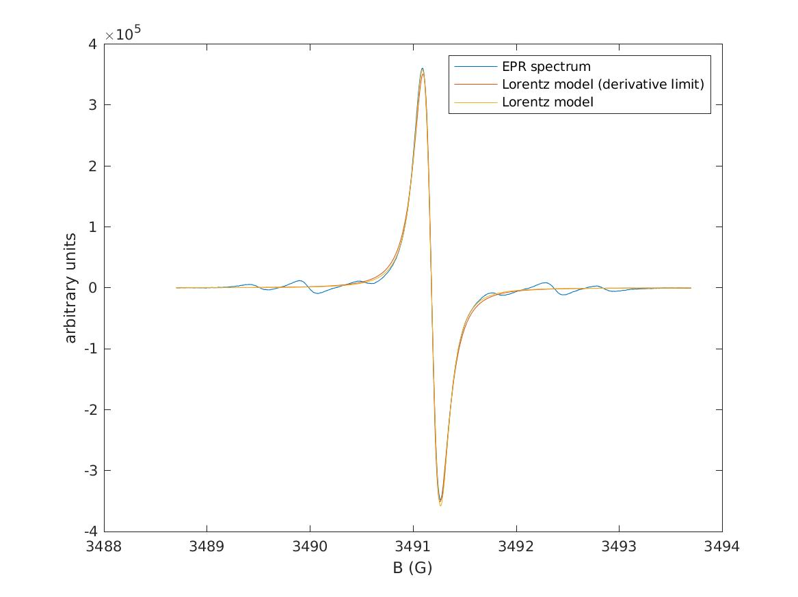

# Tutorial : how to use the functions in Matlab

In this tutorial, we show how stimate the parameters of the Lorentz Model in derivative limit and the general Lorentz model
on EPR spectra acquired on a Bruker instrument. We will follow these steps:
- set up Matlab
- load the `TAM21.DTA` file
- fit the models to the EPR spectrum and estimate the precision (creates the `parLMD` and `parLM` matlab structs)
- simulate spectra based on the models (creates the `specLMD` and `specLM` matlab vectors)
- display the EPR spectrum and the models in a figure and save as `TAM21.jpg` in the current directory.

Note that the complete transcript can be found at the bottom of this document. We also show the expected outputs of the code,
when run with Matlab 2020b on our systems.

## Set up Matlab

- You should have a working installation of Matlab. The [Easyspin](https://www.easyspin.org/) toolbox is used to read 
data from Bruker instruments. No additional toolbox is necessary.
- Download the code [here](archive/refs/heads/main.zip), and unzip.
- Start matlab in the `plz-out/gen` directory, and add `plz-out/gen/Code` to the matlab path.

```text
% cd 'plz-out/gen' % Uncomment if needed
addpath(genpath('Code'))
```

## Load the TAM21 file

EPR spectra from Bruker instruments are stored in DTA/DSC files. The `eprload` function from easyspin accepts filenames
ending in `.DTA`, `.DSC` or without extension.

```text
filename = 'Assets/Test-data/TAM21';
[XG,spec,par]=eprload(filename);
```

- `XG` contains the magnetic field in Gauss,
- `spec` contains the EPR spectrum,
- `par` contains instrument parameters.

## Fit the models to the EPR spectrum

We fit the Lorentz Model in derivative limit with default parameters with the `LorentzModelDeri` function. 
The result is a matlab structure.


```text
parLMD = LorentzModelDeri(XG,spec)
```

For the general Lorentz model, we use the `LorentzModel` function. As the model is more complex, model fitting can fail,
in which case initial parameters can be supplied as a matlab structure.


```text
parLM = LorentzModel(XG,spec,struct('Br',3491.2,'C',91008,'FWHM',0.296,'v',62924,'MA',0.5))
```


## Simulate spectra based on the obtained parameters

The `LorentzModelDeri_simulate` function (respectively `LorentzModel_simulate`) can be used to simulate an EPR spectrum 
from parameters of the Lorentz model in derivative limit (respectively the general Lorentz model). 
In this tutorial, we set `v=0` to obtain a noiseless simulation in the figure below.


```text
parLMD.v = 0; % set this for a noiseless simulation
specLMD = LorentzModelDeri_simulate (XG,parLMD);
parLM.v = 0; % set this for a noiseless simulation
specLM = LorentzModel_simulate (XG,parLM);
```


## Display the EPR spectrum and the models in a figure

```text
h_fig=figure();
plot(XG,spec,XG,specLMD,XG,specLM);
xlabel 'B (G)';ylabel ('arbitrary units');
legend('EPR spectrum','Lorentz model (derivative limit)', 'Lorentz model')
saveas (h_fig,'TAM21.jpg');
```

We recall below the complete transcript.

```text
% cd 'plz-out/gen' % Uncomment if needed
addpath(genpath('Code'))
filename = 'Assets/Test-data/TAM21';
[XG,spec,par]=eprload(filename);
parLMD = LorentzModelDeri(XG,spec)
parLM = LorentzModel(XG,spec,struct('Br',3491.2,'C',91008,'FWHM',0.296,'v',62924,'MA',0.5))
parLMD.v = 0; % set this for a noiseless simulation
specLMD = LorentzModelDeri_simulate (XG,parLMD);
parLM.v = 0; % set this for a noiseless simulation
specLM = LorentzModel_simulate (XG,parLM);
h_fig=figure();
plot(XG,spec,XG,specLMD,XG,specLM);
xlabel 'B (G)';ylabel ('arbitrary units');
legend('EPR spectrum','Lorentz model (derivative limit)', 'Lorentz model')
saveas (h_fig,'TAM21.jpg');
```

Here is the corresponding Matlab output.

```text
echo "exit" >> bruker.m  # exit the matlab session after running the commands
matlab -nodisplay -nodesktop  -r bruker
```

```text

                                                                              < M A T L A B (R) >
                                                                    Copyright 1984-2020 The MathWorks, Inc.
                                                                R2020b Update 8 (9.9.0.2037887) 64-bit (glnxa64)
                                                                                August 10, 2022

 
To get started, type doc.
For product information, visit www.mathworks.com.
 

parLMD = 

  struct with fields:

        v: 5.4491e+03
        C: 3.4777e+04
     FWHM: 0.2863
       Br: 3.4912e+03
      eBr: 1.7369e-04
    eFWHM: 6.9478e-04
       eC: 146.1915
       ev: 120.4100

 
Exiting: Maximum number of function evaluations has been exceeded
         - increase MaxFunEvals option.
         Current function value: 135637.790361 


parLM = 

  struct with fields:

        v: 4.2408e+03
        C: 2.6631e+05
       Br: 3.4912e+03
     FWHM: 0.2511
       MA: 0.1187
       ev: 93.7083
       eC: 5.3075e+03
      eBr: 1.3694e-04
      eMA: 0.0019
    eFWHM: 0.0013

```


Notes : 
- The Lorentz models are intended for single line, baseline corrected, 1D EPR spectra. To apply the code on 2D Bruker files, 
you should use a for-loop.
- To apply the code to your own dataset, you should modify `filename` and `TAM21.jpg`
- Precision estimates can be unreliable due to numerical computation errors. In that case, the functions will set precision to `-1`.